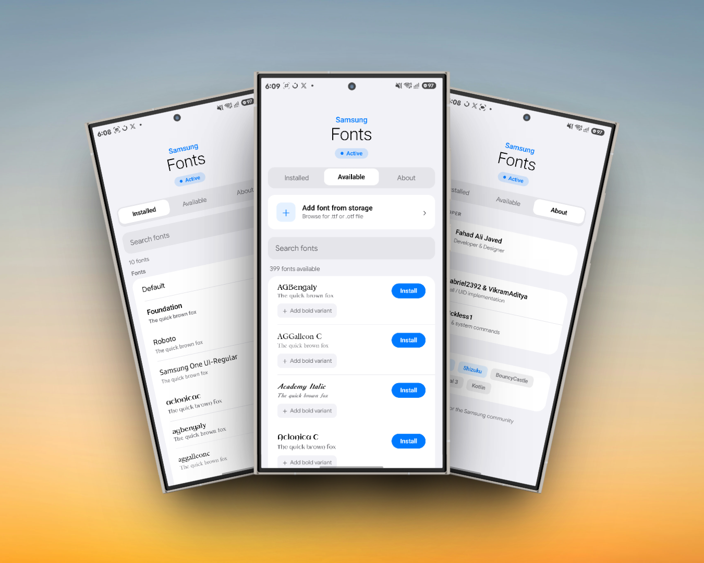

# # SamFonts
<p align="center">
  <b style="font-size: 3.5em;">SamFonts</b>
  <br><br>
  
</p>

[](https://opensource.org/licenses/Apache-2.0)
[]()
[]()

SamFonts is a powerful, ground-up rebuild utility designed for Samsung One UI devices. It allows users to dynamically generate, sign, and install custom `.ttf` and `.otf` font packages directly on-device without root, leveraging Shizuku.

Featuring a beautiful, native-feeling OneUI 8.5 design language written entirely in Jetpack Compose, SamFonts handles the heavy lifting of Android's modern font management seamlessly.

[📦 Download the Latest Release]([#](https://github.com/fahadalijaved/SamFonts/releases)) *<!-- Replace '#' with your actual GitHub release link -->*

---

## ✨ Features

### 🎨 Native OneUI 8.5 Visuals
* **Fluid UI:** Built entirely in Jetpack Compose featuring a collapsing hero header that shrinks smoothly on scroll, matching native Samsung Settings.
* **Seamless Navigation:** Animated pill-style segmented tab rows with spring physics, supporting horizontal swipe paging between *Installed*, *Available*, and *About* tabs.
* **Modern Components:** Uses the signature OneUI card system (`20dp` rounded surfaces, hairline `0.5dp` dividers, and smart top/bottom corner rounding for grouped lists).
* **True Previews:** Font preview rows render text using their **actual typefaces** via lifecycle-aware `AndroidView` caching, eliminating system font placeholders.
* **Adaptive Theming:** Full, native light and dark mode support using dynamic token swapping.

### ✒️ Advanced Font Customization
* **Any Custom Font:** Pick any `.ttf` or `.otf` file from your system storage, or drop them into `/sdcard/SamFonts/` for automatic scanning on app launch.
* **Bold Variant Support:** Attach a separate bold typeface file to any regular font. SamFonts pairs them perfectly within the generated APK.
* **Pre-Install Renaming:** A OneUI-style bottom sheet lets you sanitize and customize the exact font name that will display in your system settings.
* **Smart Source Tagging:** Automatically tracks and tags fonts as `System` (ROM-baked), `Built-in` (Monotype/Samsung packages), or `SamFonts` (installed via this app).
* **Applied Tracking:** The currently active font is pinned cleanly to an "Applied" section at the top of your list and persists across reboots.

---

## 🔧 Technical Architecture & Under-the-Hood

### Dynamic APK Generation Pipeline
SamFonts completely bypasses the need for pre-built asset packages by compiling a real, compliant Android font package on-device at runtime:
* **Binary Manifest Patching:** Implements an in-memory UTF-16 string pool patcher for `AndroidManifest.xml` to dynamically swap package names, display names, and increment version codes via AXML chunk walking.
* **Resource Alteration:** Executes byte-level UTF-8 replacement within `resources.arsc` to re-bind the `@@app_name` string asset.
* **4-Byte Alignment Optimization:** Features a custom manual ZIP builder. Because standard `ZipOutputStream` cannot guarantee exact byte alignment, our pipeline writes the archive byte-by-byte to ensure `resources.arsc` lands on a 4-byte-aligned file offset—strictly satisfying constraints required by Android 11+ (`targetSdk >= 30`).
* **On-the-Fly V2 Signing:** Integrates `apksig` alongside BouncyCastle to generate a unique RSA-2048 keypair and self-signed certificate entirely in memory per install instance.
* **Samsung Font XML Engine:** Emits a properly formatted `<font>/<sans>/<file>/<droidname>` configuration architecture parsed natively by Samsung's `FontManagerService`.

### Hardened Session-Based Installation
* Bypasses standard `pm install` blocks by implementing the modern three-step Package Installer Session API (`install-create` → `install-write` → `install-commit`) via Shizuku.
* Streams raw APK bytes directly over an IPC pipe into the installer session, guaranteeing no temporary files are exposed on public storage.

---

## ⚙️ Requirements & Compatibility

* **Device:** Samsung Galaxy Device running **One UI 8.0 or higher**
* **Android OS:** Android 14.0+ (API 34)
* **Prerequisite:** [Shizuku](https://shizuku.rikka.app/) must be running and authorized with **UID 1000 (system_server/systemshell)** privileges.
* **Permissions:** `READ_EXTERNAL_STORAGE` / `READ_MEDIA_*` (Required only for drop-folder local scanning).

---

## 🛠️ Built With

* **UI Framework:** Jetpack Compose (Material 3 tailored to OneUI 8.5 tokens)
* **Security & Cryptography:** BouncyCastle + `apksig`
* **Inter-process Communication:** Shizuku API
* **Asynchronous Execution:** Kotlin Coroutines & Flow

---

## 👥 Credits & Acknowledgments

SamFonts wouldn't be possible without the foundational work, research, and contributions of:
* **Gabriel2392**
* **VikramAditya**
* **Wr3ckless1**

---

## 📄 License

```text
Copyright 2026 SamFonts Developers

Licensed under the Apache License, Version 2.0 (the "License");
you may not use this file except in compliance with the License.
You may obtain a copy of the License at

    [http://www.apache.org/licenses/LICENSE-2.0](http://www.apache.org/licenses/LICENSE-2.0)

Unless required by applicable law or agreed to in writing, software
distributed under the License is distributed on an "AS IS" BASIS,
WITHOUT WARRANTIES OR CONDITIONS OF ANY KIND, either express or implied.
See the License for the specific language governing permissions and
limitations under the License.
